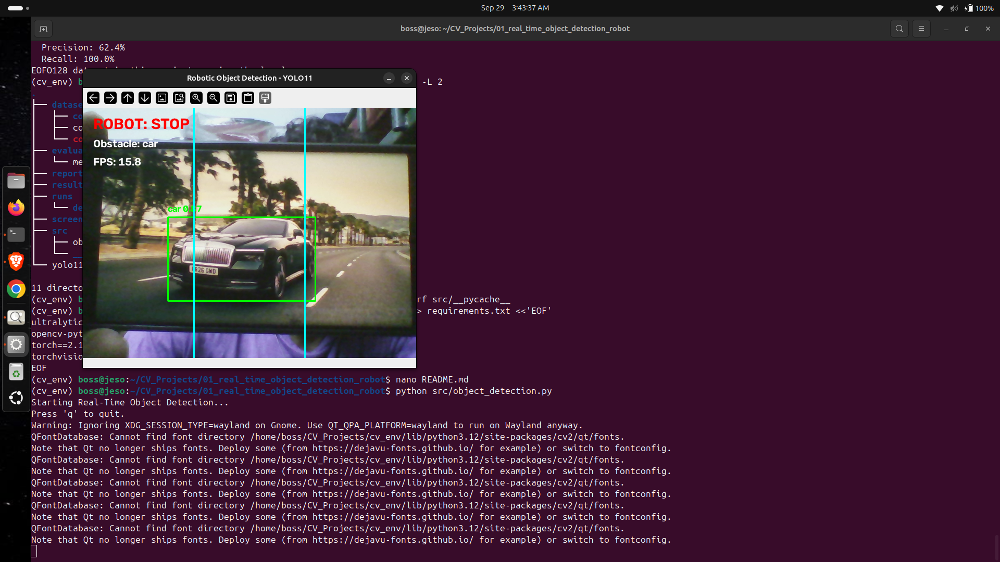

# Real-Time Object Detection for Robotic Applications

## 1. Problem Statement

Robots operating in real-world environments need to identify objects around them to make safe movement decisions. This project develops a computer vision system that detects common obstacles in real time and generates a simulated navigation decision based on the detected object's position.

## 2. Objective

The objectives of this project are:

- Detect objects in real time using a webcam.
- Identify common robotic obstacles such as people, cars, buses, bicycles and motorcycles.
- Determine whether the detected obstacle is on the left, centre or right side of the camera view.
- Generate a simulated robot decision:
  - No obstacle → MOVE
  - Obstacle on left → AVOID RIGHT
  - Obstacle in centre → STOP
  - Obstacle on right → AVOID LEFT
- Evaluate the object detection model using standard computer vision metrics.

## 3. Dataset

### COCO128

The project uses COCO128, a 128-image subset of the COCO dataset provided by Ultralytics.

The dataset contains images and YOLO-format annotations for object detection.

The YOLO11n model used in this project is pretrained on the COCO dataset. COCO128 is used here for testing and evaluation.

Dataset structure:

dataset/
└── coco128/
    ├── images/
    │   └── train2017/
    └── labels/
        └── train2017/

## 4. Methodology

The system follows this pipeline:

Webcam
   ↓
Image Frame
   ↓
YOLO11n Object Detection
   ↓
Confidence Filtering
   ↓
Obstacle Identification
   ↓
Object Position Detection
   ↓
LEFT / CENTRE / RIGHT
   ↓
Simulated Robot Decision

The camera frame is divided into three vertical regions.

### Decision Logic

| Object Position | Simulated Robot Action |
|----------------|------------------------|
| No obstacle | MOVE |
| LEFT | AVOID RIGHT |
| CENTRE | STOP |
| RIGHT | AVOID LEFT |

The system uses a confidence threshold of 0.50.

## 5. Obstacle Classes

The following COCO classes are treated as potential obstacles:

- Person
- Car
- Bus
- Bicycle
- Motorcycle

## 6. Technologies Used

- Python
- YOLO11n
- Ultralytics
- OpenCV
- PyTorch
- CUDA
- NVIDIA GPU
- Laptop Webcam

## 7. Project Structure

```text
01_real_time_object_detection_robot/
│
├── dataset/
│   ├── coco128/
│   └── coco128.yaml
│
├── evaluation/
│   └── metrics.txt
│
├── report/
│
├── results/
│
├── screenshots/
│
├── src/
│   └── object_detection.py
│
├── requirements.txt
├── README.md
└── yolo11n.pt
### Sample Output


