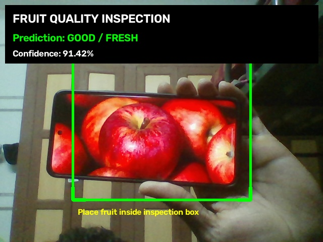
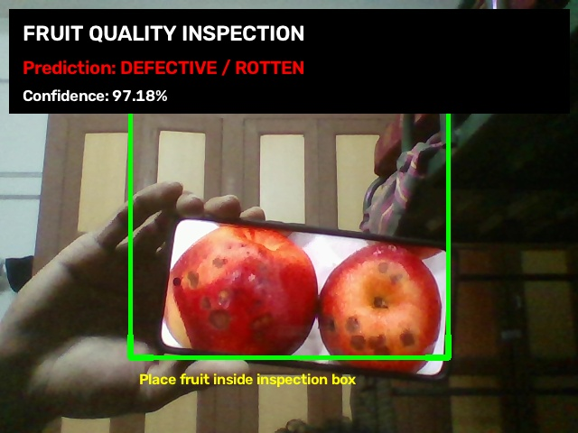

# Fruit Quality Inspection System

A computer vision system that classifies fruit as GOOD/FRESH or DEFECTIVE/ROTTEN using MobileNetV3 Small.

## Features

- Real-time webcam inspection
- Central fruit inspection zone
- MobileNetV3 Small deep-learning model
- GPU/CUDA inference
- Prediction confidence
- Prediction smoothing
- Test-set evaluation

## System Pipeline

Webcam -> Inspection Zone -> Image Preprocessing -> MobileNetV3 Small -> Prediction Smoothing -> GOOD/FRESH or DEFECTIVE/ROTTEN -> Confidence

## Dataset

Fresh vs Rotten Fruit Images dataset.

Classes:
- Good / Fresh
- Defective / Rotten

The dataset contains images of apples, bananas and strawberries.

## Model

MobileNetV3 Small with transfer learning.

Input size: 224 x 224

The final classifier was modified for two classes.

## Results

| Metric | Result |
|---|---:|
| Training images | 369 |
| Validation images | 79 |
| Test images | 81 |
| Best validation accuracy | 89.87% |
| Test accuracy | 98.77% |
| Macro F1-score | 98.65% |
| Weighted F1-score | 98.76% |

Only 1 of 81 test images was misclassified.

## Live Camera Demonstration

The system inspects fruit directly using a webcam.

### Good / Fresh

### Defective / Rotten

## Project Structure

- dataset/
- dataset_split/
- evaluation/
- models/
- report/
- results/
- screenshots/
- src/
- README.md
- requirements.txt

## Run Live Inspection

Activate the environment:

source ~/CV_Projects/cv_env/bin/activate

Run:

python src/live_camera.py

Place the fruit inside the green inspection box.

Controls:
- G - save GOOD screenshot
- D - save DEFECTIVE screenshot
- Q - quit

## Applications

- Fruit quality inspection
- Automated sorting assistance
- Food quality monitoring
- Agricultural vision systems
- Real-time computer vision inspection

## Limitation

The model classifies the freshness/quality categories represented in the training dataset. It does not identify specific types of physical defects or guarantee food safety.

## License

This project is for educational and demonstration purposes.
